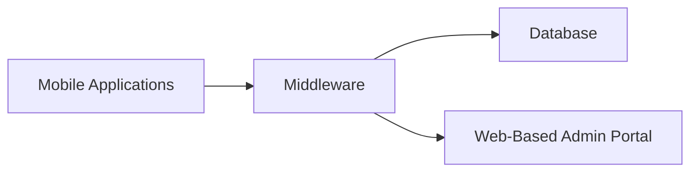

# IoT-Based Locker System

## Overview

This project involves the development of an IoT-based locker system designed to facilitate secure and efficient parcel management. The system comprises several components, including mobile applications, a web-based administration portal, and middleware to handle communication and data management.

## Applications Involved

1. **Mobile Application for Administrators, Recipients, and Couriers**
2. **Web-Based Administration Portal**
3. **Middleware for Data Handling and Communication**

## Brief Explanation of Each Application

### Mobile Application
- **Administrators**: Manage lockers, track parcel status, and oversee system operations.
- **Recipients**: Receive notifications, track parcel status, and access lockers.
- **Couriers**: Deliver parcels, update delivery status, and manage routes.

### Web-Based Administration Portal
- A comprehensive dashboard for administrators to manage users, lockers, and generate reports.

### Middleware
- Facilitates communication between the mobile apps, web portal, and the database.
- Handles RESTful API requests, socket communication, and data processing.

## Architecture/Layer Diagram

URL Endpoints
User Management
POST /api/users/register: Register a new user
POST /api/users/login: User login
GET /api/users/{id}: Retrieve user details by ID
PUT /api/users/{id}: Update user details
DELETE /api/users/{id}: Delete user
Locker Management
POST /api/lockers: Add a new locker
GET /api/lockers: Retrieve all lockers
GET /api/lockers/{id}: Retrieve locker details by ID
PUT /api/lockers/{id}: Update locker details
DELETE /api/lockers/{id}: Delete locker
Parcel Management
POST /api/parcels: Add a new parcel
GET /api/parcels: Retrieve all parcels
GET /api/parcels/{id}: Retrieve parcel details by ID
PUT /api/parcels/{id}: Update parcel details
DELETE /api/parcels/{id}: Delete parcel
Socket Endpoints
ws://{middleware_url}/notifications: WebSocket endpoint for real-time notifications
Functions/Features in the Middleware
User Authentication and Authorization
Locker Management
Parcel Tracking and Management
Real-Time Notifications
Report Generation
Database and Tables
Database: locker_system
Users Table
id: Integer, Primary Key
username: Varchar
password: Varchar
role: Varchar (Admin, Courier, Recipient)
email: Varchar
Lockers Table
id: Integer, Primary Key
location: Varchar
status: Varchar (Available, Occupied)
Parcels Table
id: Integer, Primary Key
recipient_id: Integer, Foreign Key (Users)
locker_id: Integer, Foreign Key (Lockers)
status: Varchar (Pending, Delivered, Retrieved)
Notifications Table
id: Integer, Primary Key
user_id: Integer, Foreign Key (Users)
message: Text
timestamp: Timestamp

